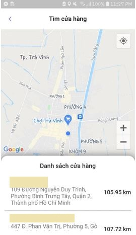

# Melodi
This is a mobile application for our Melodi system.

## Table of Content
* [Documentation](#documentation)
* [Features](#features)
* [Screenshots](#screenshots)
* [Technologies](#technologies)
* [Authors](#authors)

## Documentation:
Technical documentation of our Melodi system is located [here](https://github.com/kulcua/loyalty-backend).

## Features:
* Schedule Maintenance/ Warranty
* Realtime Chat
* Feedback
* FindNearestStore
* HappyVoucher

## Screenshots:
* Sign up and Login:
  

  
  

  

    
  

  
* Dashboard:

* Schedule Maintenance/ Warranty:
  

  
  

  

    
  

* Realtime Chat:
  

  
  

  

  
  

 
* Feedback:
  

  
  

  

  
  

  
* Find the nearest store:
  

  
  

 
* Happy Voucher:
 

  
   

  

   
  

  
## Technologies:
* Framework: Flutter
* Language: Dart

## Authors:
* Nguyễn Thị Kim Phương - nguyenphuong9995@gmail.com
* Bùi Xuân Nhã - nhabui137@gmail.com

